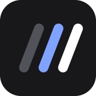

<p align="center">
  
</p>

<h1 align="center">Kanlane</h1>

<p align="center">
  Tareas, calendario, contactos y contraseñas por cliente, en un solo sitio.<br>
  Tasks, calendar, contacts and passwords per client, in one place.
</p>

<p align="center">
  <a href="https://kanlane.com"><strong>kanlane.com</strong></a>
  &nbsp;·&nbsp;
  <a href="#español">Español</a>
  &nbsp;·&nbsp;
  <a href="#english">English</a>
</p>

---

<a id="español"></a>

# Español

**Kanlane** es un gestor de trabajo para quien lleva varios clientes o proyectos a la vez: tableros kanban, calendario, contactos y contraseñas cifradas, con equipos, uso sin conexión y plugins. Funciona en el navegador, se instala como aplicación en el móvil y el ordenador, y está disponible en español e inglés.

> **Pruébalo:** entra en **[kanlane.com](https://kanlane.com)**. La portada incluye una demo interactiva del tablero (arrastra tarjetas, abre tareas) y desde ahí puedes crear tu cuenta gratis.

## Qué puedes hacer

### Organizar el trabajo
- **Tableros kanban por proyecto.** Arrastra las tareas entre etapas, o míralas en lista, con filtros rápidos por cliente, por lo que vence esta semana y por lo que tienes asignado. Elige un tipo de proyecto (soporte, desarrollo, kanban con revisión) o define tus propias etapas, con color, orden y límite de tarjetas por columna.
- **Archivo.** Archiva tareas o columnas enteras en vez de borrarlas: salen del tablero, se conservan con todo lo que tenían y se restauran desde «Archivados». Eliminar sigue siendo una acción aparte.
- **Menciones, seguir y avisos.** En los equipos, `@Nombre` en un comentario avisa a esa persona, «Seguir» una tarea te avisa de sus comentarios y movimientos, y las asignaciones también avisan: como notificaciones del sistema aunque Kanlane esté cerrado, si las activas en Ajustes.
- **Subtareas y tareas que se repiten.** Divide una tarea en pasos con su progreso, y haz que se repita cada día, semana, mes o año: al terminarla se crea la siguiente.
- **Calendario** de fechas límite y reuniones en vista de mes, semana y día. Arrastra una tarea o una reunión a otro día para moverla.
- **Clientes y contactos** en una sola sección: cada cliente con sus personas, tareas y reuniones. Colores propios por cliente.
- **Búsqueda global (`Ctrl K`)** entre tareas, notas, clientes, contactos y reuniones, con acciones rápidas.
- **Automatizaciones** por proyecto: reglas «cuando pasa algo en una tarea, haz esto» (al crearla, al moverla a una columna, al completarla o al acercarse su fecha, también con Kanlane cerrado), botones en la tarea que ejecutan varias acciones con un clic y ejemplos listos para usar.
- **Tareas por correo** (opcional): una dirección por proyecto; un mensaje enviado desde el correo de tu cuenta crea una tarea con su asunto, su texto y sus adjuntos. Necesita configurar el servidor ([docs/CAPTURA-EMAIL.md](docs/CAPTURA-EMAIL.md)); no está disponible en proyectos con cifrado total.
- **Recordatorios** de tareas que vencen y de reuniones que van a empezar, dentro de la app y con notificaciones del navegador.
- **Deshacer** al borrar una tarea, un cliente, un contacto, una reunión o una credencial.

### Trabajar en equipo
- **Proyectos compartidos** con otras cuentas: invita por correo y asigna tareas.
- **Roles:** propietario, editor y lector. Comentarios y actividad en cada tarea.
- **GitHub Projects:** sincroniza un tablero con un proyecto de GitHub (columnas, incidencias, etiquetas y pull requests).

### Cuidar los datos
- **Contraseñas cifradas en tu navegador** (AES-256) con una contraseña maestra que nunca sale de tu dispositivo, y una clave de recuperación descargable.
- **Cifrado por proyecto (opcional):** al crear un proyecto puedes elegir «Cifrado total» (el contenido se cifra en tu navegador con una contraseña que Kanlane no tiene) o «Gestionado por Kanlane» (sin contraseña extra; Kanlane custodia la clave y podría técnicamente descifrarlo). Un proyecto personal sin cifrar se puede convertir después a cifrado total, y la clave de un proyecto con cifrado total se puede cambiar (por ejemplo, tras quitar a alguien de un equipo). No se cifran el nombre del proyecto, las columnas, las etiquetas, las fechas ni el estado de las tareas.
- **Copias de seguridad:** exporta e importa un archivo, versiones automáticas en el dispositivo y copias cifradas en tu cuenta.
- **Sin publicidad ni analítica de terceros.** Las tipografías se sirven desde el propio sitio.

### Usarlo donde quieras
- **Aplicación instalable (PWA)** y **uso sin conexión**: abre con tus últimos datos y envía los cambios al volver la red.
- **Modo claro y oscuro**, colores de acento y diseño adaptado a móvil, tablet y escritorio.
- **Modo invitado** (solo un nombre, sin cuenta) y **modo local** (sin servidor, los datos se quedan en el navegador).

### Ampliarlo con plugins
Páginas web que se abren dentro de Kanlane, aisladas y con solo los permisos que tú les das. Oficiales incluidos: **Informe de trabajo**, **Temporizador**, **Smart GP** (horas por tarea y proyecto, con jornada máxima) y **Apariencia**. Cualquiera puede crear el suyo: [ver más abajo](#crear-un-plugin).

## Privacidad y seguridad

- Cada cuenta solo accede a sus datos y a los proyectos que le comparten (reglas de Firestore probadas en el emulador).
- Cabeceras de seguridad estrictas (CSP sin scripts en línea, sin marcos ajenos), límites contra abusos y App Check preparado.
- Páginas legales (privacidad, términos y cookies) y un aviso de cookies sin muros ni casillas premarcadas.

Detalles: [docs/SEGURIDAD.md](docs/SEGURIDAD.md), [docs/ROBUSTEZ.md](docs/ROBUSTEZ.md) y [docs/LEGAL.md](docs/LEGAL.md).

## Crear un plugin

Un plugin es **una página web** que se carga en un `<iframe sandbox>` y habla con Kanlane mediante un SDK pequeño. Puede tener su propio panel, añadir botones y etiquetas (en el tablero, la ficha de tarea, el calendario y `Ctrl K`), cambiar la apariencia y leer o crear tareas, siempre dentro de los permisos que el usuario aprueba al instalarlo. **Ningún plugin puede leer las contraseñas guardadas.**

Un plugin mínimo:

```html
<link rel="stylesheet" href="https://kanlane.com/plugins/sdk/workhub-plugin.css">
<p id="out">Conectando…</p>

<script src="https://kanlane.com/plugins/sdk/workhub-plugin.js"></script>
<script>
  WorkhubPlugin.connect({
    id: 'com.tu-nombre.hola',          // único y estable
    name: 'Hola',
    version: '1.0.0',
    icon: 'bolt',
    permissions: ['tasks:read']        // pide solo lo que uses
  }).then(async (wh) => {
    const tareas = await wh.tasks.list();
    document.getElementById('out').textContent =
      'Tienes ' + tareas.filter((t) => t.status !== 'completada').length + ' tareas abiertas.';
  });
</script>
```

1. Copia la carpeta [`plugins/plantilla`](plugins/plantilla) y cambia el manifiesto (`id` y `name`).
2. Publícala en una web con **https** (por ejemplo, GitHub Pages).
3. En Kanlane: **Plugins → pega el enlace → Añadir → revisa los permisos → Instalar**.

Permisos disponibles: `tasks:read`, `tasks:write`, `clients:read`, `contacts:read`, `calendar:read`, `calendar:write`, `storage`, `ui:extend` y `appearance`.

**Guía completa** (API, eventos, formularios, estilos, publicación y límites): [docs/PLUGINS.md](docs/PLUGINS.md). Los plugins oficiales de [`plugins/`](plugins) sirven de ejemplo. Los identificadores internos del SDK conservan el nombre antiguo `Workhub` (`WorkhubPlugin`, `workhub-plugin.js`) para que los plugins existentes sigan funcionando.

## Para desarrolladores

Kanlane está hecho con **JavaScript sin frameworks ni paso de compilación**: scripts clásicos, un espacio de nombres global y el patrón **MVC**. Los datos van a **Firebase** (Authentication y Firestore) y la web se publica en **Cloudflare** (Workers con recursos estáticos).

```
index.html            portada pública (con la demo del tablero)
app/                  la aplicación (/app/)
demo/                 demo interactiva que enseña la portada (/demo/)
legal/                privacidad, términos y cookies
assets/               estilos (tokens, base, componentes, vistas), fuentes e imágenes
src/
  core/ utils/        espacio de nombres, eventos, fechas, ayudas de interfaz
  models/             datos y reglas de negocio (sin DOM)
  views/              solo DOM: pintan y avisan de las acciones
  controllers/        conectan modelos y vistas
  services/           Firebase, cifrado, copias, anfitrión de plugins, PWA
  i18n/               motor de traducciones y diccionario inglés
plugins/              SDK de plugins, plantilla y plugins oficiales
worker/               Worker de Cloudflare (acceso con Firebase y dominios)
tests/ scripts/       pruebas y herramientas
docs/                 guías
```

- **Modelos** extienden `CollectionModel` (sincronizado en memoria, emite `change`). **Vistas** exponen métodos `bind…(handler)`. **Controladores** los conectan.
- **Diseño:** minimalista, plano (sin sombras ni degradados), sin emojis; todo responsive.
- **Idiomas:** el código está escrito en español y `src/i18n/en.js` traduce por coincidencia exacta del texto. `node scripts/check-i18n.js` avisa de lo que falte.

### Marca

El símbolo y la mascota de Kanlane es **Sumi**, un pulpo de tres brazos (corto, largo, medio) que son los carriles de un tablero. «Sumi» es tinta en japonés y, escrito de otra forma, «hecho».

- La forma tiene una única definición, `src/views/sumi.js`. De ella salen los SVG de la marca y el favicon (`node scripts/make-brand.js`), los iconos de la aplicación instalable (`node scripts/make-icons.js`) y la imagen para redes (`node scripts/make-og.js`).
- Las normas de uso (una sola tinta, tamaños, gestos, dónde va y dónde no) están en [`docs/marca/cuaderno-sumi.html`](docs/marca/cuaderno-sumi.html), y los archivos, en `docs/marca/svg/`.

### Ejecutarlo en local

No necesitas instalar nada más que Node:

```bash
node scripts/dev.js            # http://localhost:5500/app/  (la portada está en /)
```

La página se recarga sola al guardar. Por defecto va en **modo local** (sin cuenta; los datos se quedan en el navegador). Con `node scripts/dev.js --nube` usa el Firebase real (¡los cambios se guardan de verdad!). Otro puerto: `--puerto 8080`. En Windows también vale `start-dev.bat`.

### Pruebas

```bash
node scripts/check-js.js             # sintaxis
node scripts/check-i18n.js --strict  # traducciones
node tests/sw/sw.test.js             # service worker
node tests/demo/demo.test.js         # demo del tablero
node tests/worker/domains.test.js    # dominios y redirecciones del Worker
node tests/vault/vault.test.js && node tests/backup/backup.test.js
cd tests/rules && npm install && npm test        # reglas de Firestore (emulador)
cd ../e2e && npm install && npm test             # recorridos de navegador (Chromium)
```

Cada pull request ejecuta todo esto en GitHub Actions.

### Publicarlo

`scripts/build-public.js` copia a `dist/` solo lo que forma la web, une los scripts y estilos de cada página en unos pocos archivos y genera las cabeceras de seguridad; Cloudflare lo publica solo al fusionar en `main`. Para montar tu propia instancia: crea un proyecto de Firebase, copia su configuración en `src/config/firebase-config.js`, publica `firestore.rules` y conecta el repositorio a Cloudflare.

- [docs/FIREBASE.md](docs/FIREBASE.md): proyecto de Firebase, acceso y reglas.
- [docs/CLOUDFLARE.md](docs/CLOUDFLARE.md): publicación, dominios y redirecciones.
- [docs/GITHUB.md](docs/GITHUB.md): sincronización con GitHub Projects.
- [docs/EQUIPOS.md](docs/EQUIPOS.md): proyectos de equipo, roles e invitaciones.
- [CONTEXT.md](CONTEXT.md): estado detallado del proyecto, decisiones y pendientes.

---

<a id="english"></a>

# English

**Kanlane** is a work manager for people who juggle several clients or projects: kanban boards, a calendar, contacts and encrypted passwords, with teams, offline use and plugins. It runs in the browser, installs as an app on phone and desktop, and is available in Spanish and English.

> **Try it:** go to **[kanlane.com](https://kanlane.com)**. The home page has an interactive board demo (drag cards, open tasks) and you can create a free account from there. *(The home page is currently in Spanish only; the app itself can be switched to English in Settings.)*

## What you can do

### Organize your work
- **Kanban boards per project.** Drag tasks between stages, or view them as a list, with quick filters by client, by what is due this week and by what is assigned to you. Pick a project type (support, development, kanban with review) or define your own stages, with colors, order and per-column card limits.
- **Archive.** Archive tasks or whole columns instead of deleting them: they leave the board, keep everything they had and can be restored from "Archived". Deleting is still a separate action.
- **Mentions, following and notifications.** In teams, `@Name` in a comment notifies that person, following a task notifies you of its comments and moves, and assignments notify too: as system notifications even when Kanlane is closed, if you turn them on in Settings.
- **Subtasks and recurring tasks.** Split a task into steps with progress, and make it repeat daily, weekly, monthly or yearly: finishing it creates the next one.
- **Calendar** of due dates and meetings in month, week and day views. Drag a task or a meeting to another day to move it.
- **Clients and contacts** in a single section: each client with its people, tasks and meetings. Per-client colors.
- **Global search (`Ctrl K`)** across tasks, notes, clients, contacts and meetings, with quick actions.
- **Automations** per project: rules like “when something happens to a task, do this” (when it is created, moved to a column, completed or close to its due date, even with Kanlane closed), buttons on the task that run several actions in one click, and ready-made examples.
- **Tasks by email** (optional): one address per project; a message sent from your account's email creates a task with its subject, text and attachments. It needs server setup ([docs/CAPTURA-EMAIL.md](docs/CAPTURA-EMAIL.md), in Spanish) and is not available in fully encrypted projects.
- **Reminders** for tasks that are due and meetings about to start, in the app and as browser notifications.
- **Undo** when deleting a task, client, contact, meeting or credential.

### Work as a team
- **Shared projects** with other accounts: invite by email and assign tasks.
- **Roles:** owner, editor and viewer. Comments and activity on every task.
- **GitHub Projects:** sync a board with a GitHub project (columns, issues, labels and pull requests).

### Take care of your data
- **Passwords encrypted in your browser** (AES-256) with a master password that never leaves your device, plus a downloadable recovery key.
- **Per-project encryption (optional):** when you create a project you can choose "Full encryption" (the content is encrypted in your browser with a password Kanlane doesn't have) or "Managed by Kanlane" (no extra password; Kanlane holds the key and could technically decrypt it). An unencrypted personal project can later be converted to full encryption, and the key of a fully encrypted project can be changed (for example, after removing someone from a team). The project name, columns, labels, dates and task status are not encrypted.
- **Backups:** export and import a file, automatic versions on the device and encrypted copies in your account.
- **No ads and no third-party analytics.** Fonts are served from the site itself.

### Use it anywhere
- **Installable app (PWA)** and **offline use**: it opens with your latest data and sends your changes when the network is back.
- **Light and dark mode**, accent colors, and a layout that adapts to phone, tablet and desktop.
- **Guest mode** (just a name, no account) and **local mode** (no server, data stays in the browser).

### Extend it with plugins
Web pages that open inside Kanlane, sandboxed and limited to the permissions you grant. Official plugins included: **Work report**, **Timer**, **Smart GP** (hours per task and project, with a daily limit) and **Appearance**. Anyone can build their own: [see below](#build-a-plugin).

## Privacy and security

- Each account can only access its own data and the projects shared with it (Firestore rules tested against the emulator).
- Strict security headers (CSP with no inline scripts, no third-party framing), abuse limits and App Check support.
- Legal pages (privacy, terms and cookies) and a cookie notice with no walls or pre-ticked boxes.

Details: [docs/SEGURIDAD.md](docs/SEGURIDAD.md), [docs/ROBUSTEZ.md](docs/ROBUSTEZ.md) and [docs/LEGAL.md](docs/LEGAL.md) *(in Spanish)*.

## Build a plugin

A plugin is **a web page** loaded in a `<iframe sandbox>` that talks to Kanlane through a small SDK. It can have its own panel, add buttons and labels (on the board, the task view, the calendar and `Ctrl K`), change the appearance, and read or create tasks, always within the permissions the user approves on install. **No plugin can read the stored passwords.**

A minimal plugin:

```html
<link rel="stylesheet" href="https://kanlane.com/plugins/sdk/workhub-plugin.css">
<p id="out">Connecting…</p>

<script src="https://kanlane.com/plugins/sdk/workhub-plugin.js"></script>
<script>
  WorkhubPlugin.connect({
    id: 'com.your-name.hello',         // unique and stable
    name: 'Hello',
    version: '1.0.0',
    icon: 'bolt',
    permissions: ['tasks:read']        // ask only for what you use
  }).then(async (wh) => {
    const tasks = await wh.tasks.list();
    document.getElementById('out').textContent =
      'You have ' + tasks.filter((t) => t.status !== 'completada').length + ' open tasks.';
  });
</script>
```

1. Copy the [`plugins/plantilla`](plugins/plantilla) folder (the template) and change the manifest (`id` and `name`).
2. Publish it on an **https** website (for example, GitHub Pages).
3. In Kanlane: **Plugins → paste the link → Add → review the permissions → Install**.

Available permissions: `tasks:read`, `tasks:write`, `clients:read`, `contacts:read`, `calendar:read`, `calendar:write`, `storage`, `ui:extend` and `appearance`.

**Full guide** (API, events, forms, styling, publishing and limits): [docs/PLUGINS.md](docs/PLUGINS.md) *(in Spanish)*. The official plugins in [`plugins/`](plugins) are complete examples. The SDK's internal identifiers keep the old `Workhub` name (`WorkhubPlugin`, `workhub-plugin.js`) so existing plugins keep working.

## For developers

Kanlane is built with **vanilla JavaScript, no frameworks and no build step**: classic scripts, a global namespace and the **MVC** pattern. Data lives in **Firebase** (Authentication and Firestore) and the site is published on **Cloudflare** (Workers with static assets).

```
index.html            public home page (with the board demo)
app/                  the application (/app/)
demo/                 interactive demo shown on the home page (/demo/)
legal/                privacy, terms and cookies
assets/               styles (tokens, base, components, views), fonts and images
src/
  core/ utils/        namespace, events, dates, UI helpers
  models/             data and business rules (no DOM)
  views/              DOM only: render state and report user actions
  controllers/        connect models and views
  services/           Firebase, encryption, backups, plugin host, PWA
  i18n/               translation engine and English dictionary
plugins/              plugin SDK, template and official plugins
worker/               Cloudflare Worker (Firebase sign-in and domains)
tests/ scripts/       tests and tooling
docs/                 guides
```

- **Models** extend `CollectionModel` (kept in sync in memory, emits `change`). **Views** expose `bind…(handler)` methods. **Controllers** wire them together.
- **Design:** minimal and flat (no shadows or gradients), no emojis, fully responsive.
- **Languages:** the code is written in Spanish and `src/i18n/en.js` translates by exact text match. `node scripts/check-i18n.js` reports anything missing.

### Brand

Kanlane's symbol and mascot is **Sumi**, a three-armed octopus (short, long, medium) whose arms are the lanes of a board. "Sumi" is Japanese for ink and, written differently, for "done".

- The shape has a single definition, `src/views/sumi.js`. The brand SVGs and the favicon (`node scripts/make-brand.js`), the installable app icons (`node scripts/make-icons.js`) and the social image (`node scripts/make-og.js`) are generated from it.
- The usage rules (single ink, sizes, expressions, where it goes and where it does not) are in [`docs/marca/cuaderno-sumi.html`](docs/marca/cuaderno-sumi.html), in Spanish, and the files are in `docs/marca/svg/`.

### Run it locally

You only need Node:

```bash
node scripts/dev.js            # http://localhost:5500/app/  (the home page is at /)
```

The page reloads on save. It runs in **local mode** by default (no account; data stays in the browser). `node scripts/dev.js --nube` uses the real Firebase (changes are saved for real!). Another port: `--puerto 8080`. On Windows `start-dev.bat` also works.

### Tests

```bash
node scripts/check-js.js             # syntax
node scripts/check-i18n.js --strict  # translations
node tests/sw/sw.test.js             # service worker
node tests/demo/demo.test.js         # board demo
node tests/worker/domains.test.js    # Worker domains and redirects
node tests/vault/vault.test.js && node tests/backup/backup.test.js
cd tests/rules && npm install && npm test        # Firestore rules (emulator)
cd ../e2e && npm install && npm test             # browser walkthroughs (Chromium)
```

Every pull request runs all of this in GitHub Actions.

### Deploying

`scripts/build-public.js` copies only what makes up the site into `dist/`, joins each page's scripts and stylesheets into a few files and generates the security headers; Cloudflare publishes it automatically when something is merged into `main`. To run your own instance: create a Firebase project, put its config in `src/config/firebase-config.js`, publish `firestore.rules` and connect the repository to Cloudflare.

- [docs/FIREBASE.md](docs/FIREBASE.md): Firebase project, sign-in and rules.
- [docs/CLOUDFLARE.md](docs/CLOUDFLARE.md): publishing, domains and redirects.
- [docs/GITHUB.md](docs/GITHUB.md): GitHub Projects sync.
- [docs/EQUIPOS.md](docs/EQUIPOS.md): team projects, roles and invitations.
- [CONTEXT.md](CONTEXT.md): detailed project state, decisions and open items.

*Most guides in `docs/` are written in Spanish.*
