# Rediseño de Kanlane: «cristal limpio»

Documento de traspaso para aplicar a toda la web el diseño aprobado en la maqueta.
Está escrito para que otra sesión pueda hacerlo sin el contexto de la conversación original.

- **Maqueta navegable (la referencia que manda):** `docs/rediseno/maqueta.html` (abrirla desde el repositorio, en el navegador)
- **Capturas:** en esta misma carpeta, `app-oscuro-*.png` y `app-claro-*.png`
- **Repositorio:** `yalerooo/Kanlane`
- **Estado:** diseño aprobado por el propietario sobre la maqueta. No hay nada aplicado todavía en la app.

Si este documento y la maqueta discrepan, manda la maqueta: los valores exactos están en su `<style>`.

---

## 1. Qué se ha decidido

1. El estilo es **glassmorphism clásico y sobrio** (el de 2023), no «liquid glass»: sin círculos ni formas de color detrás, sin brillos, sin degradados en botones.
2. **Base neutra.** El fondo es casi blanco o casi negro. El color solo aparece como un velo muy tenue en dos esquinas del fondo y en el acento.
3. **El cristal se usa poco y siempre igual:** barra lateral, barra superior de cada vista y lo que se superpone (ficha de tarea, diálogos). El contenido (tarjetas, paneles, tablas) va en superficies sólidas con borde fino.
4. **Un solo acento.** Botón principal, día de hoy, casillas marcadas, interruptores y progreso. Todo lo demás es escala de grises más los colores de estado y de cliente.
5. **Acento por defecto: Grafito** (negro en claro, casi blanco en oscuro). Se mantienen los siete acentos que ya tiene la app.
6. **Claro y oscuro**, los dos cuidados por igual.
7. **Navegación lateral por defecto, con opción de ponerla arriba** (ajuste nuevo en Apariencia).
8. Las columnas del tablero **no son cajas**: título y tarjetas directamente sobre el fondo.

Descartado durante el proceso, para no repetirlo: la portada animada del PR `yalerooo/Kanlane#113` (está fusionada en `main`, pero no gustó y se rehace), el cristal con orbes de colores detrás, los degradados de color a pantalla completa, las columnas como paneles de cristal y las etiquetas de colores chillones en las tarjetas.

## 2. Reglas que siguen en vigor

Vienen de `CONTEXT.md` y de la memoria del propietario. Léase `CONTEXT.md` entero antes de empezar.

- Todo en español: interfaz, commits y PR.
- **Prohibidas las rayas o barras de acento en el lateral de un elemento** (`border-left` de color, `box-shadow: inset 2px 0 0`, pseudoelementos que dibujen una barra). Lo seleccionado se marca con fondo suave, borde completo, punto o insignia.
- Sin emojis en la interfaz.
- Sin claves, tokens ni secretos en archivos o PR. No tocar `data-backup.json`.
- No añadir analítica ni cambiar la versión del consentimiento de cookies sin preguntar.
- Un solo `push` por PR. El enlace del PR debe llevar título y descripción ya rellenos.
- En esta máquina un hook rechaza editar fuera del worktree de la sesión: crear el worktree con `git worktree add` en la ruta que pida y trabajar ahí.
- La app es JavaScript sin compilación (MVC, espacio de nombres `Workhub.*`). No introducir dependencias ni un paso de build.

`CONTEXT.md` dice hoy que el diseño va «sin sombras, degradados…». Este rediseño cambia esa norma: hay que **actualizar ese apartado de `CONTEXT.md`** en el mismo PR.

## 3. Sistema de diseño

### 3.1 Tipografía y medidas

| Elemento | Valor |
|---|---|
| Fuente | Geist (ya está en `assets/fonts`), Geist Mono para dominios, IP, puertos y atajos |
| Texto base | 13px, interlineado 1.45 |
| Título de vista (barra superior) | 15px, peso 600 |
| Título de tarjeta | 13.5px, peso 550 |
| Título de la ficha de tarea | 21px, peso 600, `letter-spacing: -.02em` |
| Secundario / pistas | 12–12.5px |
| Alto de controles (botón, buscador, segmentado) | 32px; variante pequeña 28px |
| Fila de navegación | 32px |
| Barra superior de vista | 52px |
| Radios | 16px cristal (lateral y barra), 18px ficha, 14px panel, 12px tarjeta, 9px control, 6px etiqueta |
| Separación entre lateral y contenido | 12px; relleno exterior 12px |
| Ancho del lateral | 236px |

### 3.2 Color

Tema claro:

| Token de la maqueta | Valor | Uso |
|---|---|---|
| `--bg` | `#f4f5f7` | fondo |
| `--ink` | `#17181c` | texto |
| `--soft` | `#5d6068` | texto secundario |
| `--faint` | `#9498a2` | pistas, contadores |
| `--surface` | `#fff` | tarjetas y paneles |
| `--line` | `rgba(23,24,28,.08)` | bordes |
| `--line-strong` | `rgba(23,24,28,.14)` | bordes de control |
| `--hover` | `rgba(23,24,28,.045)` | paso del ratón |
| `--fill` | `rgba(23,24,28,.055)` | seleccionado, buscador, etiquetas |
| `--glass` | `rgba(255,255,255,.62)` | relleno del cristal |
| `--glass-line` | `rgba(255,255,255,.9)` | borde del cristal |
| `--sheet` | `rgba(255,255,255,.82)` | ficha y diálogos |
| `--overlay` | `rgba(230,232,238,.55)` | velo tras la ficha |

Tema oscuro:

| Token | Valor |
|---|---|
| `--bg` | `#0a0a0c` |
| `--ink` | `#ededf0` |
| `--soft` | `#a0a3ad` |
| `--faint` | `#6b6f7a` |
| `--surface` | `rgba(255,255,255,.045)` |
| `--line` | `rgba(255,255,255,.075)` |
| `--line-strong` | `rgba(255,255,255,.14)` |
| `--hover` | `rgba(255,255,255,.05)` |
| `--fill` | `rgba(255,255,255,.07)` |
| `--glass` | `rgba(255,255,255,.04)` |
| `--glass-line` | `rgba(255,255,255,.08)` |
| `--sheet` | `rgba(22,22,27,.78)` |
| `--overlay` | `rgba(4,4,6,.6)` |

Estados (claro / oscuro): vencida `#c2410c` / `#fb923c`, hoy `#a16207` / `#fbbf24`, hecha `#15803d` / `#4ade80`, cada una con su fondo al 10–13 %.
Columnas: pendiente `#9498a2`, en proceso `#3b82f6`, esperando `#f59e0b`, completada `#22c55e` (anillo de 9px; la completada, relleno).

Acentos (claro / oscuro) y velo del fondo:

| Acento | Claro | Oscuro | Velo (`--hue-a`, `--hue-b`) |
|---|---|---|---|
| Grafito (por defecto) | `#18181b` | `#f4f4f5` | `#71717a`, `#71717a` |
| Azul | `#2563eb` | `#7aa9ff` | `#3b82f6`, `#6366f1` |
| Violeta | `#4f46e5` | `#9b9dff` | `#6366f1`, `#d946ef` |
| Rosa | `#db2777` | `#ff86bd` | `#ec4899`, `#f97316` |
| Verde | `#0d8f6f` | `#4fd6a8` | `#14b8a6`, `#22c55e` |
| Naranja | `#e0492d` | `#ff8a6b` | `#f97316`, `#ec4899` |
| Ámbar | `#b45309` | `#fbbf24` | `#f59e0b`, `#f97316` |

El texto sobre el acento es blanco en claro y `#0a0a0c` en oscuro.

### 3.3 Fondo y cristal

```css
/* Fondo: color plano + dos manchas muy difusas. Nada más. */
.scene{position:fixed;inset:0;z-index:0;background:
  radial-gradient(60% 70% at 0% 0%,color-mix(in srgb,var(--hue-a) calc(var(--wash) * 100%),transparent) 0,transparent 70%),
  radial-gradient(55% 65% at 100% 100%,color-mix(in srgb,var(--hue-b) calc(var(--wash) * 70%),transparent) 0,transparent 70%)}
/* --wash: .18 en claro, .16 en oscuro */

.glass{background:var(--glass);border:1px solid var(--glass-line);
  backdrop-filter:blur(24px) saturate(1.4);box-shadow:var(--glass-shadow)}
/* sombra: claro 0 1px 2px rgba(20,22,40,.04), 0 12px 32px -12px rgba(20,22,40,.12)
           oscuro 0 12px 32px -12px rgba(0,0,0,.6) */
```

La ficha de tarea y los diálogos usan `--sheet` con `blur(32px) saturate(1.5)`, y el velo de detrás `--overlay` con `blur(6px)`.
Nunca se anida cristal dentro de cristal: dentro de un panel de cristal, los elementos van con `--surface` o `--fill`.
Hay que incluir `-webkit-backdrop-filter` y comprobar que sin soporte de `backdrop-filter` el texto sigue siendo legible (subir la opacidad del relleno con `@supports not`).

### 3.4 Componentes

- **Botón principal:** fondo acento, 32px, radio 9px, peso 550. **Secundario** (`.ghost`): superficie con borde `--line-strong`.
- **Botón de icono:** 32px (26px el pequeño), sin fondo; fondo `--hover` al pasar.
- **Segmentado:** pista `--fill`, radio 9px; opción activa con superficie, sombra mínima y borde `--line`.
- **Buscador:** relleno `--fill`, sin borde, con el atajo en Geist Mono a la derecha.
- **Etiqueta** (`.pill`): 22px, radio 6px, fondo `--fill`; variantes vencida, hoy y hecha.
- **Punto de cliente:** cuadrado de 8px con radio 3px del color del cliente.
- **Avatar:** círculo con iniciales sobre un pastel, con un anillo del color de la superficie cuando se apilan.
- **Interruptor:** 34×20px, acento cuando está activo.
- **Panel:** `--surface`, borde `--line`, radio 14px. Las filas internas se separan con una línea, no con cajas.
- **Navegación:** elemento activo con fondo `--fill` y peso 550. Sin barra lateral de color.

## 4. Pantallas

### 4.1 Tareas (tablero)

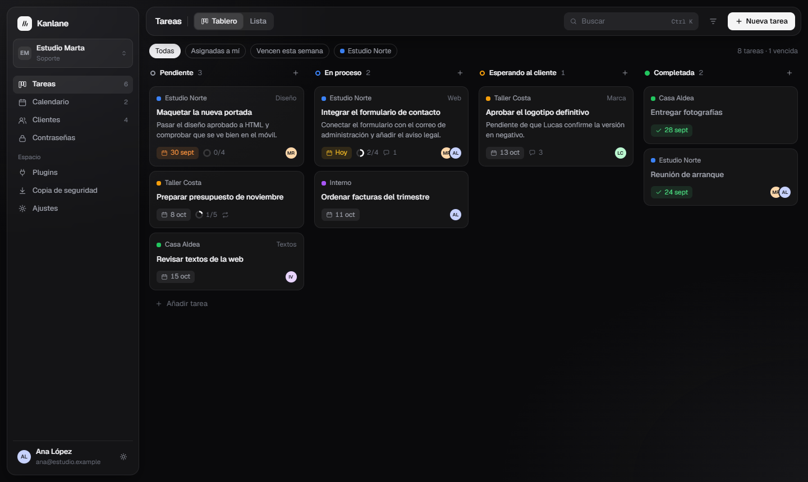
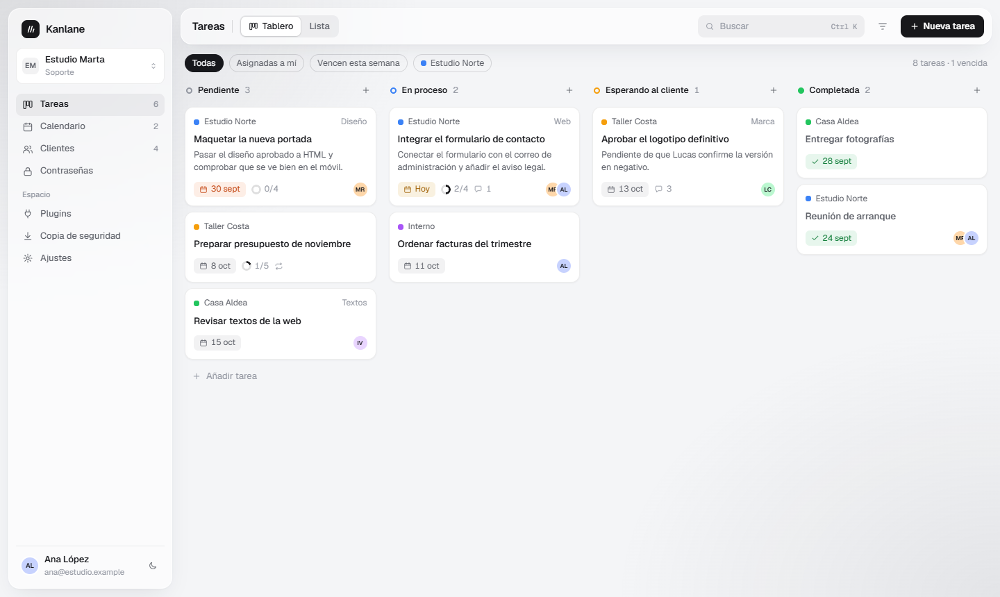

- Barra de cristal: título, segmentado Tablero/Lista, buscador, filtro y «Nueva tarea».
- Columnas sin caja: anillo de estado, nombre, contador y «+».
- Tarjeta: cliente con su punto y la etiqueta a la derecha; título; descripción a dos líneas como máximo; pie con fecha (etiqueta que se tiñe si vence hoy o está vencida), progreso de subtareas en anillo con «n/m», número de comentarios, icono de repetición y avatares a la derecha.
- Tarjeta completada: título atenuado y fecha en verde con marca.
- Al pasar el ratón: borde más marcado, sombra suave y 1px hacia arriba.

La fila de filtros rápidos («Todas», «Asignadas a mí», «Vencen esta semana», cliente) **no existe hoy en la app**. Es opcional: hacerla solo si se conecta al filtrado real; si no, omitirla.

### 4.2 Tarea abierta

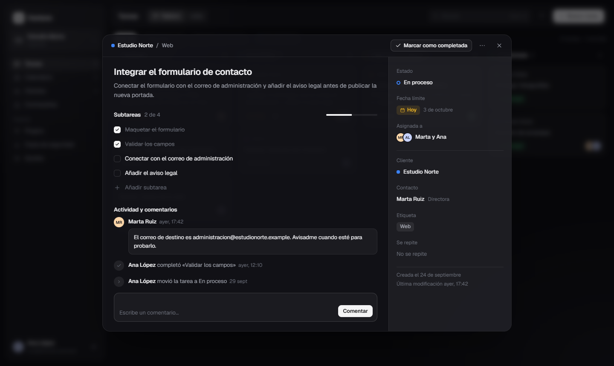
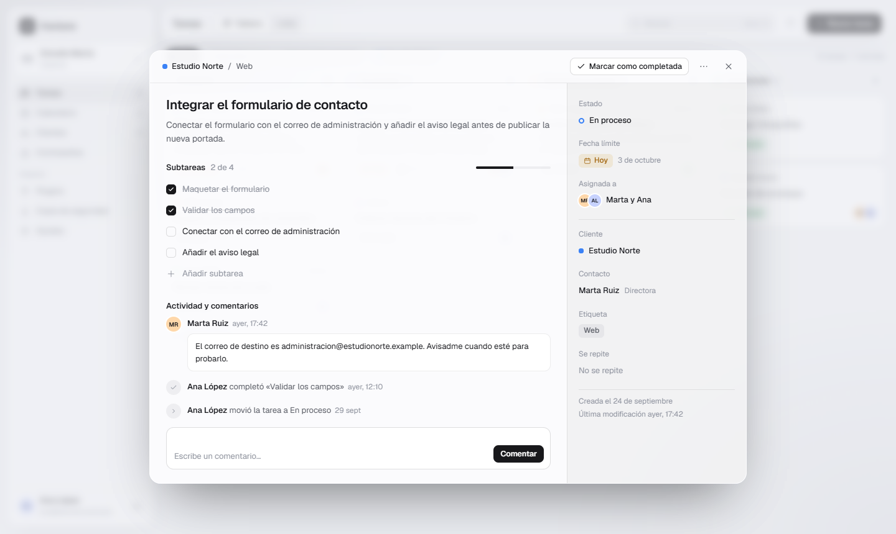

- Ficha centrada (ancho máximo 960px) sobre el tablero desenfocado, en lugar del panel estrecho actual.
- Cabecera: cliente / etiqueta, «Marcar como completada», más opciones y cerrar.
- Columna principal: título, descripción, subtareas con barra de progreso y «Añadir subtarea», y «Actividad y comentarios» con los comentarios en burbuja, los cambios en una línea y la caja para comentar.
- Columna derecha (288px, fondo algo más oscuro): estado, fecha límite, asignación, cliente, contacto, etiqueta, repetición, y al pie las fechas de creación y de última modificación.
- En móvil la columna derecha pasa debajo de la principal y la ficha ocupa toda la pantalla.

Todo lo que ya enseña `task-detail-view.js` (GitHub, «Asignármela», proyectos cifrados que no se pueden descifrar, etc.) debe conservarse; la maqueta solo muestra el caso común.

### 4.3 Calendario

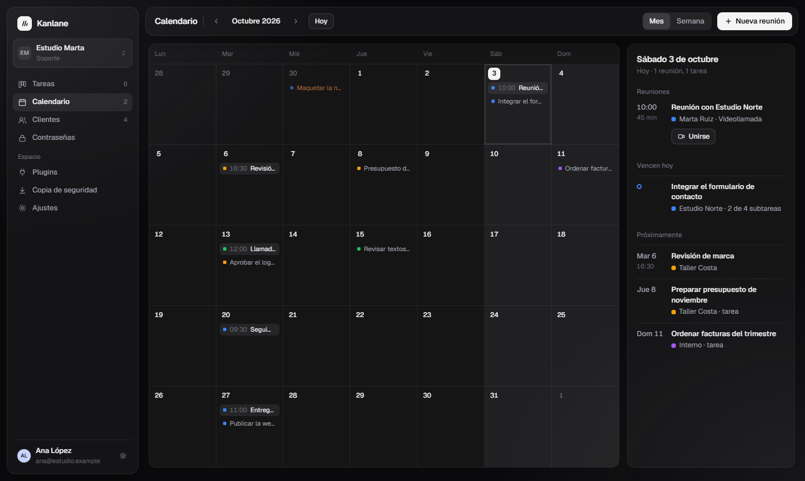
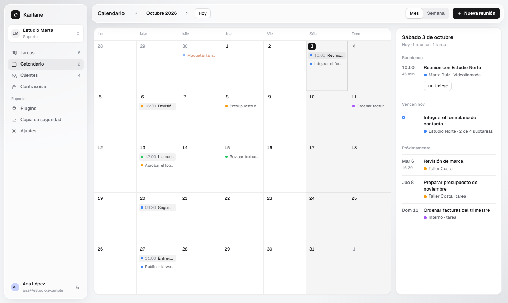

- Barra: mes con flechas, «Hoy», segmentado Mes/Semana y «Nueva reunión».
- Mes en un panel: fines de semana con fondo `--hover`, día de hoy con el número sobre el acento, día seleccionado con borde completo.
- Reuniones como etiqueta con hora; tareas como línea con el punto del cliente; las vencidas en el color de vencida.
- A la derecha (300px), la agenda del día seleccionado: reuniones, lo que vence y «Próximamente».

**Pendiente de afinar:** en la vista de mes los nombres se cortan demasiado. Hay que resolverlo al implementar (por ejemplo, la hora en una línea propia o permitir dos líneas).

### 4.4 Clientes y contactos

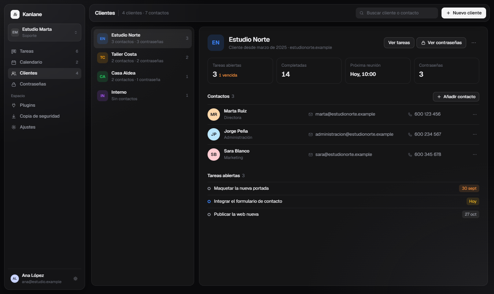
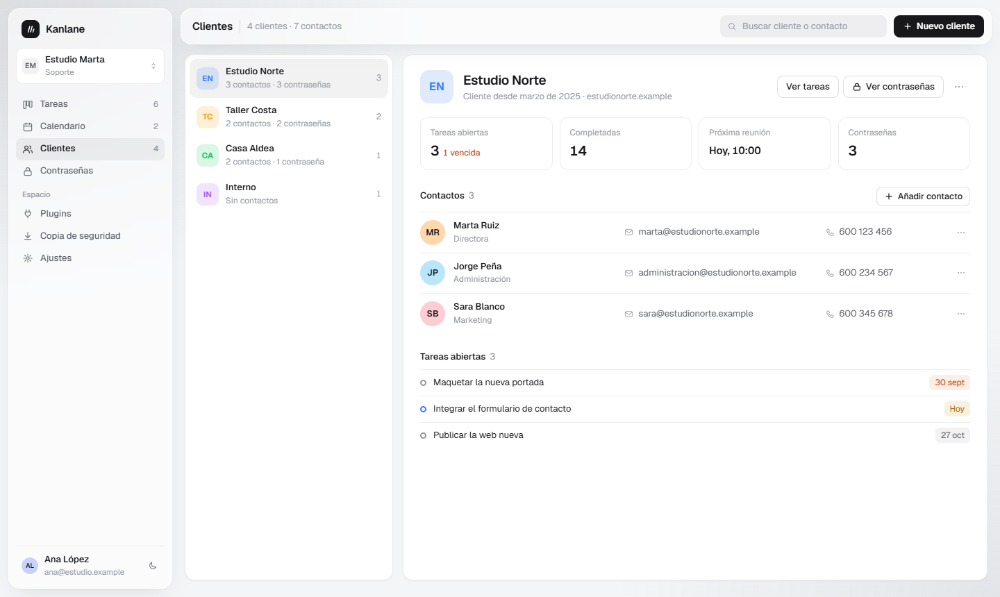

- Lista a la izquierda (300px): iniciales sobre el color del cliente al 16 %, nombre, resumen y número de tareas abiertas.
- Ficha a la derecha: cabecera con «Ver tareas» y «Ver contraseñas», contactos en filas (avatar, nombre y cargo, correo, teléfono, más) y tareas abiertas con su fecha.

Las cuatro cifras de la cabecera («Completadas», «Próxima reunión»…) y el «Cliente desde» son de ejemplo: mostrar solo las que salgan de datos que la app ya tiene.

### 4.5 Contraseñas

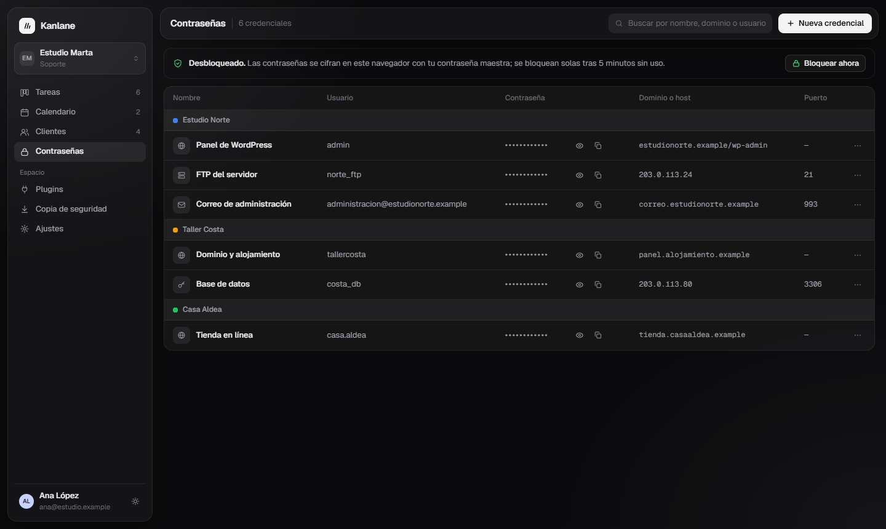

- Aviso de estado arriba (bloque plano con borde fino, sin raya lateral) con «Bloquear ahora».
- Tabla en un panel, agrupada por cliente: nombre con icono, usuario, contraseña oculta con mostrar y copiar, dominio o host y puerto en Geist Mono, y más opciones.
- Las pantallas de bloqueo y de crear la contraseña maestra (`vault-lock-view.js`) no están en la maqueta: aplicarles el mismo cristal de la ficha.

### 4.6 Plugins

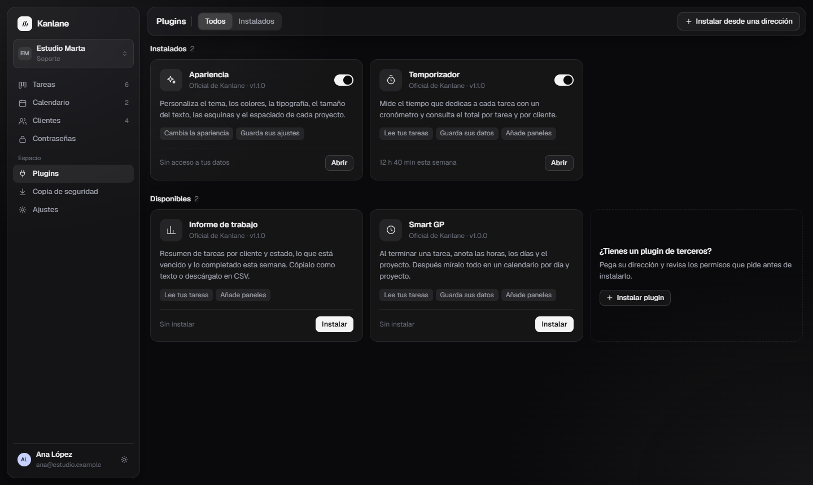

- Secciones «Instalados» y «Disponibles».
- Tarjeta: icono en un cuadro neutro, nombre, «Oficial de Kanlane · versión», descripción, permisos como etiquetas y pie con la acción («Abrir» o «Instalar»). Los instalados llevan interruptor.
- Tarjeta de borde discontinuo para instalar un plugin de terceros.
- El texto «12 h 40 min esta semana» del temporizador es de ejemplo; no implementarlo.

### 4.7 Ajustes

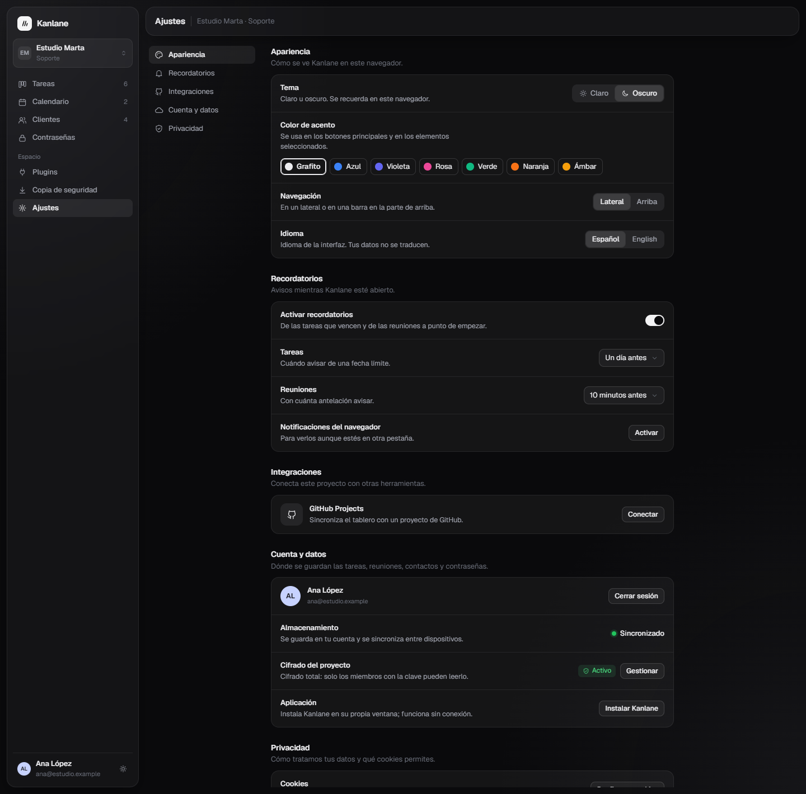

- Índice a la izquierda (Apariencia, Recordatorios, Integraciones, Cuenta y datos, Privacidad) y grupos a la derecha, cada uno un panel con filas «título + descripción + control».
- **Apariencia:** tema, color de acento (siete muestras), **navegación lateral o arriba (ajuste nuevo)** e idioma.
- La app tiene hoy tres opciones de tema (Sistema, Claro, Oscuro); la maqueta solo dibuja dos. **Conservar las tres.**
- Todo lo que hay hoy en `#viewSettings` de `app/index.html` debe seguir estando: GitHub Projects, recordatorios con sus dos desplegables y las notificaciones, instalación de la aplicación, privacidad con sus enlaces legales y almacenamiento con la cuenta.

### 4.8 Navegación arriba

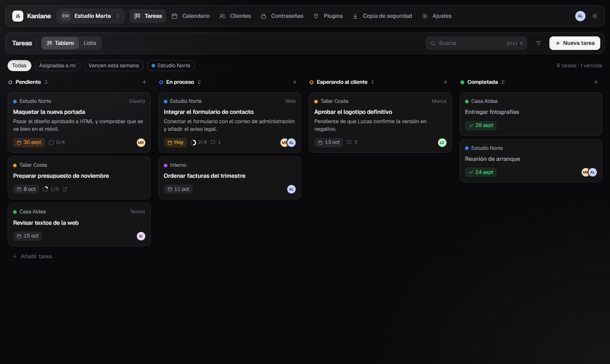

La misma barra de cristal tumbada: marca, selector de proyecto, secciones en línea, y a la derecha el usuario. Se ocultan los contadores y los subtítulos.

### 4.9 Lo que no está en la maqueta

Hay que diseñarlo con las mismas piezas, sin inventar un lenguaje nuevo:

- Copia de seguridad (`backup-view.js`).
- Vista de lista de tareas.
- Diálogos: nueva tarea, nuevo proyecto, privacidad y cifrado del proyecto, compartir, unirse, rotación y conversión de claves.
- Inicio de sesión y registro (`auth-view.js`), paleta de comandos, avisos emergentes, menús desplegables, esqueletos de carga.
- Equipo y GitHub.
- **Móvil y tableta** (`responsive.css`): la maqueta solo cubre escritorio. Mantener el comportamiento actual (barra de iconos hasta 1100px, navegación inferior en móvil) con el estilo nuevo.
- Portada, páginas de captación SEO y páginas legales.

## 5. Cómo llevarlo al código

### 5.1 Dónde se toca

| Qué | Archivos |
|---|---|
| Tokens, temas y acentos | `assets/css/tokens.css`, `src/models/settings-model.js`, `src/views/settings-view.js` (`applyAccent`, `applyTheme`) |
| Fondo, estructura, lateral y barra | `assets/css/base.css`, `assets/css/layout.css`, `assets/css/components/toolbar.css`, `src/views/shell-view.js`, `app/index.html` |
| Componentes | `assets/css/components/*.css` (botones, formularios, desplegables, tarjetas, diálogos, superposiciones, proyectos) |
| Vistas | `assets/css/views/*.css` y su vista en `src/views/` (`board`, `task-detail`, `calendar`, `clients`, `vault`, `plugins`, `settings`, `auth`, `team`, `github`, `privacy`) |
| Adaptación a móvil | `assets/css/responsive.css` |
| Plugin Apariencia | `assets/css/components/appearance.css`, `plugins/apariencia/` |
| Demo de la portada | `demo/index.html`, `src/demo/` |
| Portada y SEO | `index.html`, `en/index.html`, `assets/css/landing*.css`, `assets/css/seo-pages.css`, `assets/css/legal.css` |

### 5.2 Tokens: ampliar, no renombrar

La app ya usa `--bg`, `--surface`, `--surface-2`, `--surface-3`, `--ink`, `--ink-soft`, `--ink-faint`, `--line`, `--line-strong`, `--accent`, `--accent-ink`, `--accent-soft`, `--hover`, `--sidebar`, `--st-*` y `--shadow-*`. Los plugins y el plugin Apariencia dependen de esos nombres.

- **Mantener los nombres actuales** y cambiarles el valor. Equivalencias con la maqueta: `--soft` → `--ink-soft`, `--faint` → `--ink-faint`, `--fill` → `--surface-2`.
- **Añadir** los que faltan: `--glass`, `--glass-line`, `--glass-shadow`, `--sheet`, `--overlay`, `--wash`, `--hue-a`, `--hue-b`.
- Cada acento de `settings-model.js` necesita además sus dos tonos de velo.

### 5.3 Decisiones que hay que confirmar con el propietario antes de programar

1. **Acento por defecto.** Propuesta: Grafito para quien no haya elegido ninguno; no tocar la elección ya guardada de nadie.
2. **Dónde se guarda «navegación lateral o arriba».** Propuesta: junto al tema y el acento, en los ajustes locales del navegador.
3. **Plugin Apariencia.** Hoy cambia tema, colores, tipografía, tamaño, esquinas y espaciado por proyecto. Hay que comprobar que sigue funcionando con los tokens nuevos y decidir si absorbe el ajuste de navegación o se queda como está.
4. **Filtros rápidos del tablero** y **cifras de la ficha del cliente:** hacerlos de verdad o dejarlos fuera.

### 5.4 Orden de trabajo

El propietario quiere **un PR**. Para que sea revisable, commits ordenados así (si resulta inmanejable, proponerle partirlo antes de hacerlo):

1. Tokens, fondo y clase de cristal; acentos con velo; Grafito por defecto.
2. Estructura: lateral, barra superior de vista, opción de navegación arriba y su ajuste.
3. Componentes comunes: botones, formularios, segmentados, desplegables, etiquetas, avatares, diálogos y avisos.
4. Tablero y tarjetas.
5. Ficha de tarea.
6. Calendario, clientes y contactos, contraseñas, plugins, ajustes, copia de seguridad.
7. Inicio de sesión, equipo, GitHub, privacidad y resto de diálogos.
8. Adaptación a móvil y tableta.
9. Demo de la portada (`demo/index.html` es una instantánea del HTML de la app: hay que regenerarla).
10. Portada, páginas SEO y legales con los mismos tokens. La portada animada de `yalerooo/Kanlane#113` ya está en `main` (`assets/css/landing-motion.css`, `src/landing/landing-motion.js`, clase `html.js-motion`): no gustó, así que la portada se rehace en este estilo y hay que preguntar al propietario qué animaciones se conservan. Mantener todo el SEO actual (títulos, descripciones, canónicas, hreflang, JSON-LD, contenido sin JavaScript).
11. Actualizar `CONTEXT.md` (norma de diseño y descripción de las vistas).

### 5.5 Comprobaciones antes de abrir el PR

- Suite completa del repositorio, en particular `tests/e2e/smoke.js`, `tests/e2e/landing-check.js` y `tests/demo/demo.test.js` (comprueban ids, anchuras de 320 a 1280px, sin JavaScript y movimiento reducido).
- Cada vista en claro y oscuro, con Grafito y con al menos un acento de color, a 1440, 1280, 1024, 768 y 375px, sin desplazamiento horizontal.
- Contraste AA del texto sobre cristal en ambos temas, incluido el texto atenuado.
- Navegación por teclado y foco visible; `prefers-reduced-motion` respetado.
- Sin soporte de `backdrop-filter`, todo sigue siendo legible.
- Rendimiento: el desenfoque solo en lateral, barra y superposiciones; nunca en cada tarjeta.
- Proyectos con cifrado total, modo invitado y modo sin conexión siguen funcionando igual (es un cambio visual: no tocar modelos ni reglas de Firestore).
- Capturas de antes y después en la descripción del PR.

## 6. Mensaje para empezar la otra sesión

> Lee `CONTEXT.md` del repositorio Kanlane y después `docs/rediseno/REDISENO.md`. Abre la maqueta `docs/rediseno/maqueta.html` y sus capturas: es el diseño aprobado. Antes de programar, pregúntame las decisiones del apartado 5.3. Después aplica el rediseño a toda la web siguiendo el orden del apartado 5.4, haz las comprobaciones del 5.5 y abre un PR con título y descripción en español.

## 7. Archivos de esta carpeta

| Archivo | Qué es |
|---|---|
| `maqueta.html` | Maqueta navegable aprobada. Admite `#vista=tareas|calendario|clientes|contrasenas|plugins|ajustes&tema=claro|oscuro&pal=grafito|azul|…&nav=lateral|arriba&ficha=1` |
| `app-oscuro-1…8-*.png` | Las siete pantallas en oscuro y la navegación arriba |
| `app-claro-1…7-*.png`, `app-claro-9-violeta.png` | Las mismas en claro, y el tablero con acento violeta |

La maqueta carga Geist desde `../../assets/fonts/`, así que debe abrirse desde esta carpeta del repositorio. `docs/` no se publica (`scripts/build-public.js` no la copia), de modo que nada de esto llega a producción.
